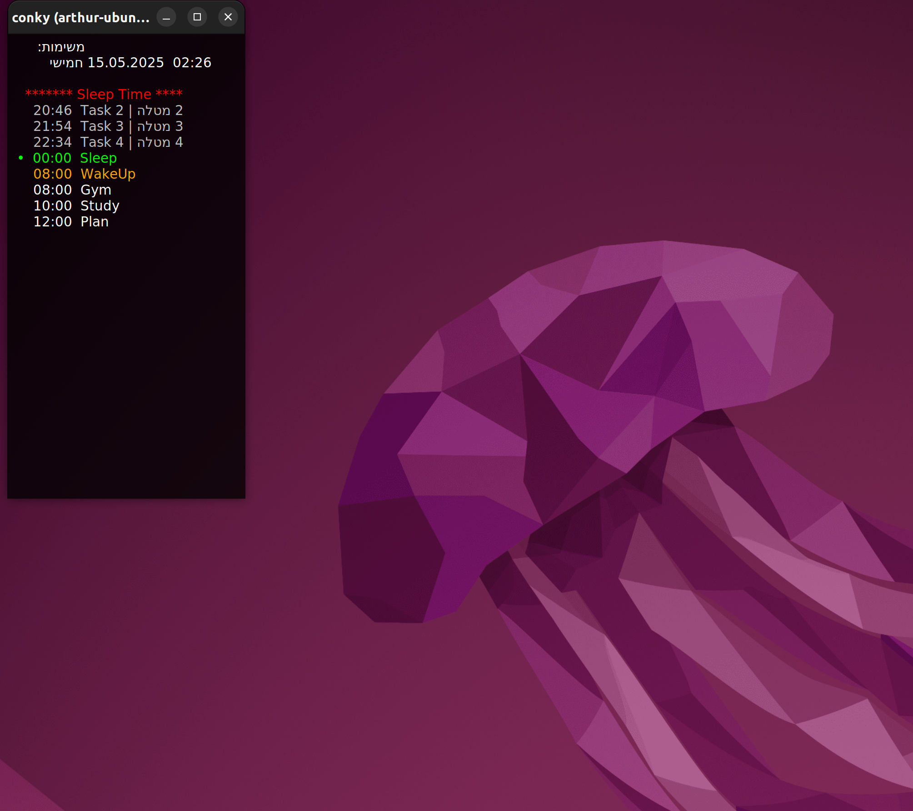

# Hebrew Schedule Widget for Conky

This project displays a real-time, right-to-left (RTL) compatible task list on your desktop using Conky. It supports Hebrew text, color-coded tasks, and dynamic updates from a CSV file.



---

## 📁 Project Structure

```
.
├── conky.conf                # Conky configuration file
├── run.sh                   # Script to run Conky with correct environment
├── startup_conky.sh         # Script to autostart Conky on Ubuntu boot
├── schedule.csv             # Your daily task list in CSV format
├── schedule_widget.py       # Main entry point
├── schedule_config.py       # Configuration dictionary
├── schedule_utils_rtl.py    # Hebrew locale + RTL text helpers
├── schedule_utils_logic.py  # CSV loading and scheduling logic
├── schedule_utils_text_style.py  # Task styling and coloring
├── schedule_utils_ui_render.py   # Rendering of headers and output
```

---

## 🧰 Installation

```bash
sudo apt update
sudo apt install conky
```

---

## ▶️ Running

To run the widget manually:
```bash
pkill -x conky; sleep 1 && LANG=he_IL.UTF-8 conky -c ./conky.conf &
```

Or via the script:
```bash
./run.sh
```

---

## 📋 CSV Format

`schedule.csv` should be structured like this:

```csv
time,task
08:00,Start the day
10:00,[!] Important Meeting
12:00,Lunch
14:00,Code Review
```

> Tasks marked with `[!]` are considered **important** and shown in orange.

---

## 🚀 Autostart on Ubuntu

To run on boot:

1. Set: `chmod +x  /path/to/startup_conky.sh`
2. Open **Startup Applications**
3. Click **Add**
4. Name: `Conky Schedule`
5. Command: `/path/to/startup_conky.sh`
6. Save and reboot


---

## 👤 Author

Created by Arthur (Open Source Dev, Conky+Python enthusiast)

---

## ⚖️ License

This project is free to use.  
**No warranties or guarantees. Use at your own risk.**